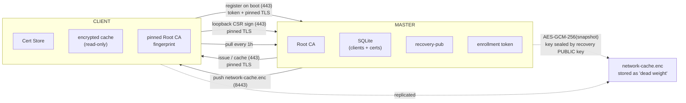
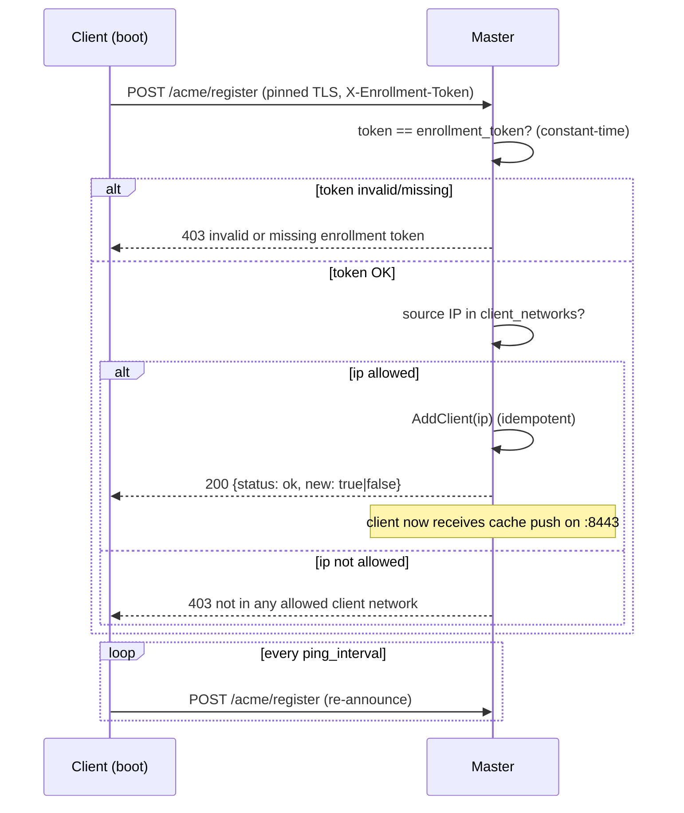

# NATSSL

**Zero-Configuration Distributed TLS for Private Infrastructure.**

NATSSL is a zero-configuration distributed TLS solution built for private infrastructure. 
Shipped as a single, lightweight binary, it functions as an enterprise Certificate Authority (Root CA) 
while ensuring absolute infrastructure resilience.


---

## Table of Contents
- [Features](#features)
- [Architecture](#architecture)
- [Requirements](#requirements)
- [Building](#building)
- [Quick Start](#quick-start)
- [Security Model](#security-model)
- [Client Auto-Registration](#client-auto-registration)
- [Issuing a Certificate as a Client (CSR-flow)](#issuing-a-certificate-as-a-client-csr-flow)
- [Configuration](#configuration)
- [Disaster Recovery](#disaster-recovery)
- [Command Reference](#command-reference)
- [License](#license)

---

## Features

| Category | Capabilities |
|---|---|
| **Master** | Bootstrap Root CA (10y), issue any cert, sign loopback CSRs, replicated AES-GCM-256 cache |
| **Client** | Auto-install Root CA into OS and Firefox, **auto-register by subnet + token**, **issue loopback certs for itself**, ReadOnly mode when the master is down |
| **Registration** | Clients self-register on startup; the master authorizes them by **enrollment token (anti-spoofing) AND source-IP CIDR** — no manual IP list |
| **Transport** | Client→master path is **Root CA pinned** (SHA-256 fingerprint or chain) — no blind `InsecureSkipVerify` |
| **DR** | 24-word seed (BIP-39), promote-to-master restoring the *identical* fingerprint |
| **Network** | IPv4/IPv6, static discovery, ports `443` (ACME) and `8443` (mTLS) |
| **Localhost** | Certificates for `127.0.0.1`/`::1`/`localhost` valid 1 year, *Same-PC only*, private key encrypted with a password |

---

## Architecture



On disaster, a client holding the seed phrase decrypts the cache and becomes
the master **with the same serial number and SHA-256 fingerprint** of the
Root CA.

---

---

## Download

Pre-built binaries for **1.0.8** ([release page](https://github.com/iskyneon/natssl/releases/tag/1.0.8)):

| Platform | Architecture | Download |
|---|---|---|
| Linux | amd64 | [natssl-1.0.8-oss-linux-amd64.tar.gz](https://github.com/iskyneon/natssl/releases/download/1.0.8/natssl-1.0.8-oss-linux-amd64.tar.gz) |
| Linux | arm64 | [natssl-1.0.8-oss-linux-arm64.tar.gz](https://github.com/iskyneon/natssl/releases/download/1.0.8/natssl-1.0.8-oss-linux-arm64.tar.gz) |
| macOS (Intel) | amd64 | [natssl-1.0.8-oss-darwin-amd64.tar.gz](https://github.com/iskyneon/natssl/releases/download/1.0.8/natssl-1.0.8-oss-darwin-amd64.tar.gz) |
| macOS (Apple Silicon) | arm64 | [natssl-1.0.8-oss-darwin-arm64.tar.gz](https://github.com/iskyneon/natssl/releases/download/1.0.8/natssl-1.0.8-oss-darwin-arm64.tar.gz) |

```bash
# example: Linux amd64
curl -fsSL -O https://github.com/iskyneon/natssl/releases/download/1.0.8/natssl-1.0.8-oss-linux-amd64.tar.gz
tar -xzf natssl-1.0.8-oss-linux-amd64.tar.gz
sudo install -m 0755 natssl-1.0.8-oss-linux-amd64 /usr/local/bin/natssl
natssl --version

---

## Requirements

- **Go 1.22+** (for building)
- Linux: Ubuntu/Debian/CentOS/RHEL/Rocky
- For Firefox integration: `certutil`
  - Debian/Ubuntu: `apt-get install libnss3-tools`
  - RHEL/Rocky/CentOS: `dnf install nss-tools`

---

## Building

```bash
# Cross-compile for amd64 + arm64
make release
# or without make:
./build.sh
```

Output:

```
dist/
├── natssl-1.0.0-oss-linux-amd64.tar.gz
├── natssl-1.0.0-oss-linux-arm64.tar.gz
└── SHA256SUMS.txt
```

Pack the entire source tree into an archive:

```bash
./pack.sh     # -> natssl-src.tar.gz  (uses `git archive` when in a repo)
```

Install the binary:

```bash
tar -xzf natssl-1.0.0-oss-linux-amd64.tar.gz
sudo install -m 0755 natssl-1.0.0-oss-linux-amd64 /usr/local/bin/natssl
natssl --version
```

> **Note:** SQLite is provided by the pure-Go `modernc.org/sqlite` driver, so
> the build uses `CGO_ENABLED=0` and cross-compiles cleanly without a C toolchain.

---

## Quick Start

### 1. Generate a shared enrollment token (once)

```bash
openssl rand -hex 32
# e.g. 9f1c...  — put this SAME value on the master and on every client
```

### 2. Master

```bash
sudo natssl --mode=master --bootstrap
# Write down the 24 words OFFLINE — shown only ONCE!
# Also note the SHA-256 fingerprint printed here — clients pin it.

sudo systemctl enable --now natssl-master
sudo natssl --mode=master --issue "app.internal"
```

After bootstrap, from the master's `/etc/natssl/config.yaml` copy:
- `recovery_public_key` (auto-filled)
- the Root CA **fingerprint** (printed at bootstrap, or `openssl x509 ... -fingerprint -sha256`)

Set `enrollment_token` in the master config to the value from step 1.

### 3. Client

In the client's `/etc/natssl/config.yaml` set:
- `master_address`
- `master_fingerprint` (the value from step 2)
- `enrollment_token` (the value from step 1)
- `recovery_public_key` (from the master)

Then:

```bash
sudo systemctl enable --now natssl-client
```

The client pins the master's Root CA, installs it, and **registers itself**
(token + IP) automatically. No manual IP list is required.

---

## Security Model

Three independent controls protect the system:

| Control | Protects against | Mechanism |
|---|---|---|
| **Enrollment token** | IP spoofing on flat L2 (rogue self-registration) | Shared secret in `X-Enrollment-Token`, compared in constant time |
| **Root CA pinning** | Rogue master / MITM on client→master | Client verifies the master's cert against a pinned SHA-256 fingerprint, or that it chains to the locally installed Root CA. **Fail-closed** if neither is available |
| **Loopback-only clients** | Host impersonation via the shared Root CA | Clients can only obtain `localhost`/`127.0.0.1`/`::1` certs; enforced client-side **and** server-side (HTTP 403) |

Additional guarantees:

- The recovery private key is **never written to disk** on the master.
- The network cache is encrypted with AES-GCM-256; the symmetric key is sealed
  with the recovery public key (NaCl SealedBox) → clients cannot decrypt it.
- The client leaf private key **never leaves the machine** (CSR-flow) and is
  stored encrypted (scrypt N=2¹⁵ + AES-GCM-256) under the user's password.
- Migration packets are signed with the Root CA key and verified by clients.

> ⚠️ **Honest residual gaps (OSS edition):**
> - The enrollment token is a **shared** secret — compromise of one client
>   leaks it for all. The clean fix is per-client mTLS identities issued at
>   enrollment (commercial edition).
> - The **master→client push** (`:8443`) is not mutually authenticated; the
>   payload is already AES-GCM-encrypted + sealed, so no plaintext is exposed,
>   but enabling strict mTLS on this direction is recommended for production.
> See "Hardening" in [docs/DEPLOYMENT.md](docs/DEPLOYMENT.md).

---

## Client Auto-Registration

Clients are **not** listed by hand. The master authorizes self-registration by
**two** gates that must **both** pass:

1. **Enrollment token** — a shared secret in the `X-Enrollment-Token` header
   (defeats IP spoofing).
2. **Network CIDR** — the client's source IP must fall inside a
   `client_networks` range.



> If `enrollment_token` is empty on the master, it logs a warning and falls
> back to **CIDR-only** (spoofable). If `client_networks` is empty, no client
> can register. The optional static `clients:` list remains as a fallback.

Verify registrations on the master:

```bash
journalctl -u natssl-master | grep "client registered"
# client registered: 192.168.10.20
```

---

## Issuing a Certificate as a Client (CSR-flow)

> **Hard rule:** a client can issue certificates **only for loopback**
> (`localhost`, `127.0.0.1`, `::1`). Any other domain or IP is **rejected** —
> both locally (before contacting the master) and on the master (HTTP 403).
>
> Certificates for real domains/IPs are issued **only by the administrator**
> on the master via `natssl --mode=master --issue "..."`.

| Requester | Allowed targets |
|---|---|
| **Client** (`--mode=client --issue`) | `localhost`, `127.0.0.1`, `::1` only |
| **Admin** (`--mode=master --issue`) | any `*.internal` / `*.local` / IP / domain |

The leaf private key is generated **locally** on the client and never leaves
the machine; only the public part travels inside the CSR. The CSR is sent over
the **pinned** transport.

### Allowed (client)

```bash
sudo natssl --mode=client --issue "localhost" --localhost
sudo natssl --mode=client --issue "127.0.0.1"
# ↳ you will be prompted for a password to encrypt the private key
```

Result:

```
✔ Loopback certificate issued for "localhost"
  cert: /var/lib/natssl/issued/localhost.crt
  key : /var/lib/natssl/issued/localhost.key.enc  (encrypted, this PC only)
```

### Rejected (client)

```bash
sudo natssl --mode=client --issue "dev.internal"   # -> error: loopback only
sudo natssl --mode=client --issue "192.168.10.20"  # -> error: loopback only
```

### Decrypt the private key for use

```bash
natssl --mode=client \
  --decrypt-key=/var/lib/natssl/issued/localhost.key.enc > /tmp/localhost.key
chmod 600 /tmp/localhost.key
```

Use it in a dev server (Go example):

```go
cert, _ := tls.LoadX509KeyPair(
    "/var/lib/natssl/issued/localhost.crt",
    "/tmp/localhost.key",
)
srv := &http.Server{
    Addr:      ":8443",
    TLSConfig: &tls.Config{Certificates: []tls.Certificate{cert}},
}
```

The browser already trusts the certificate — the Root CA was installed by the
client into the OS and Firefox.

> ⚠️ If the master is unreachable, issuing new certificates is **blocked**
> (ReadOnly). Previously issued certificates keep working until they expire.

---

## Configuration

The repository ships two example files: `config.master.yaml` and
`config.client.yaml`. Install the appropriate one as `/etc/natssl/config.yaml`.

### Master — `config.master.yaml`

```yaml
mode: master
data_dir: /var/lib/natssl
listen:
  acme: ":443"
  mgmt: ":8443"
recovery_public_key: ""          # auto-filled on bootstrap
enrollment_token: "REPLACE_ME"   # openssl rand -hex 32  (anti-spoofing)
client_networks:                 # WHO is allowed to self-register
  - "192.168.10.0/24"
  - "10.0.0.0/16"
# clients: []                    # optional static fallback; usually empty
pull_interval: 1h
```

### Client — `config.client.yaml`

```yaml
mode: client
data_dir: /var/lib/natssl
master_address: "192.168.10.5"        # REQUIRED — the client self-registers here
master_fingerprint: "AB:CD:..."       # SHA-256 of master Root CA (pinning)
recovery_public_key: "<paste from master>"
enrollment_token: "REPLACE_ME"        # SAME value as on the master
ping_interval: 5m                     # also drives the re-registration cadence
```

| Field | Where | Purpose |
|---|---|---|
| `enrollment_token` | both | Shared secret required to self-register. Defeats IP spoofing. Generate with `openssl rand -hex 32`. |
| `master_fingerprint` | client | SHA-256 of the master's Root CA cert. The client pins the master to this value (works even before the CA is on disk). Colons optional. |
| `client_networks` | master | Allowed subnets (CIDR). A client may register only if its source IP is inside one of them. Empty ⇒ no client can register. |
| `master_address` | client | The master's IP. The client registers here on startup and pulls the cache from it. |
| `recovery_public_key` | both | Auto-filled on the master at bootstrap; copied to clients. Needed to decrypt the cache during recovery. |
| `ping_interval` | client | Re-registration cadence (survives a master restart / DB reset). |
| `pull_interval` | master | Cache fan-out cadence to all registered clients. |
| `clients` | master (optional) | Legacy manual push list. No longer required — leave empty. |

Generate the secrets:

```bash
# Enrollment token (run once; same value on master + every client)
openssl rand -hex 32

# Master fingerprint (if you didn't copy it from bootstrap output)
openssl x509 -in /var/lib/natssl/root-ca.crt -noout -fingerprint -sha256
```

---

## Disaster Recovery

```bash
sudo natssl --mode=client --promote-to-master \
  --token="word1 word2 ... word24"
```

A mandatory **safety chain** runs before activation:

1. TCP health-check of the old master (`443`/`8443`) → alive → **abort**.
2. ICMP + ARP (`/proc/net/arp`) → responds → **block**.
3. Local IP conflict with the old master → **block**.

See [docs/DEPLOYMENT.md](docs/DEPLOYMENT.md) for details.

---

## Command Reference

| Command | Purpose |
|---|---|
| `natssl --mode=master --bootstrap` | Initialize Root CA + seed phrase; prints fingerprint |
| `natssl --mode=master` | Run the master (443 + 8443) |
| `natssl --mode=master --issue "X" [--localhost]` | Issue any cert (master generates the key) |
| `natssl --mode=client` | Run the client (pin + install CA, auto-register, pull/receive cache) |
| `natssl --mode=client --issue "localhost"` | **Issue a loopback cert for yourself** (CSR-flow) |
| `natssl --mode=client --decrypt-key=FILE` | Decrypt a `.key.enc` to stdout |
| `natssl --mode=client --promote-to-master --token="..."` | Disaster-recovery promotion |
| `natssl --version` | Show version |

---

## License

Apache-2.0 (OSS version). Clustering (Raft, N>1 masters) and per-client mTLS
enrollment are part of the commercial edition.
