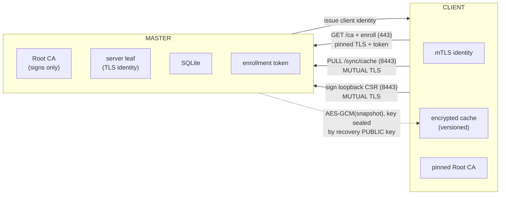

# NATSSL

**Zero-Configuration Distributed TLS for Private Infrastructure.**

A single binary acting as a Certificate Authority (Root CA) for private
networks, with disaster recovery via a 24-word BIP-39 seed phrase — no mDNS,
no cloud.


---

## Table of Contents
- [Features](#features)
- [Architecture](#architecture)
- [Requirements](#requirements)
- [Building](#building)
- [Download](#Download)
- [Quick Start](#quick-start)
- [Deployment](#deployment)
- [Security Model](#security-model)
- [Issuing Certificates as the Administrator (Master)](#issuing-certificates-as-the-administrator-master)
- [Client Auto-Registration](#client-auto-registration)
- [Issuing a Certificate as a Client (CSR-flow)](#issuing-a-certificate-as-a-client-csr-flow)
- [Revocation](#revocation)
- [Configuration](#configuration)
- [Disaster Recovery](#disaster-recovery)
- [Command Reference](#command-reference)
- [License](#license)

---

## Features

| Category | Capabilities |
|---|---|
| **Master** | Bootstrap Root CA (10y), CLI-only admin issuance (any target), mTLS CSR signing, replicated AES-GCM-256 cache, revocation |
| **Client** | Auto-install Root CA into OS + Firefox, auto-enroll (token + subnet), receive an **mTLS identity**, issue loopback certs for itself, ReadOnly when master is down |
| **Transport** | Bootstrap path **pinned to the Root CA**; control plane is **mutual TLS** on `:8443` |
| **Replication** | **Pull-only** encrypted cache with **monotonic versioning** (anti-replay/stale); no inbound push surface |
| **Isolation** | Root CA key **only ever signs** — TLS is served with a dedicated server leaf |
| **DR** | 24-word seed (BIP-39), promote-to-master restoring the *identical* fingerprint |
| **Localhost** | 1-year, Same-PC-only certs; private key encrypted with scrypt + AES-GCM |

---

## Architecture



The Root CA private key signs the **server leaf**, the **client identities**,
and issued certificates — it is never used as an online TLS key.

---

## Requirements

- **Go 1.22+** (build)
- Linux: Ubuntu/Debian/CentOS/RHEL/Rocky
- Firefox integration: `certutil` (`libnss3-tools` / `nss-tools`)

---

## Building

```bash
make release         # cross-compile amd64 + arm64 tarballs into dist/
# or:
./build.sh
```

Output:

```
dist/
├── natssl-1.0.7-oss-linux-amd64.tar.gz
├── natssl-1.0.7-oss-linux-arm64.tar.gz
└── SHA256SUMS.txt
```

Pack the source tree:

```bash
./pack.sh            # -> natssl-src.tar.gz (git archive when in a repo)
```

Install:

```bash
tar -xzf natssl-1.0.7-oss-linux-amd64.tar.gz
sudo install -m 0755 natssl-1.0.7-oss-linux-amd64 /usr/local/bin/natssl
natssl --version
```

> Pure-Go build (`modernc.org/sqlite`, `CGO_ENABLED=0`) — no C toolchain, clean
> cross-compile.

---

## Download

Pre-built binaries for **1.0.8** ([release page](https://github.com/iskyneon/natssl/releases/tag/1.0.8)):

| Platform | Architecture | Download |
|---|---|---|
| Linux | amd64 | [natssl-1.0.8-oss-linux-amd64.tar.gz](https://github.com/iskyneon/natssl/releases/download/1.0.8/natssl-1.0.8-oss-linux-amd64.tar.gz) |
| Linux | arm64 | [natssl-1.0.8-oss-linux-arm64.tar.gz](https://github.com/iskyneon/natssl/releases/download/1.0.8/natssl-1.0.8-oss-linux-arm64.tar.gz) |
| macOS (Intel) | amd64 | [natssl-1.0.8-oss-darwin-amd64.tar.gz](https://github.com/iskyneon/natssl/releases/download/1.0.8/natssl-1.0.8-oss-darwin-amd64.tar.gz) |
| macOS (Apple Silicon) | arm64 | [natssl-1.0.8-oss-darwin-arm64.tar.gz](https://github.com/iskyneon/natssl/releases/download/1.0.8/natssl-1.0.8-oss-darwin-arm64.tar.gz) |

```bash
# example: Linux amd64
curl -fsSL -O https://github.com/iskyneon/natssl/releases/download/1.0.8/natssl-1.0.8-oss-linux-amd64.tar.gz
tar -xzf natssl-1.0.8-oss-linux-amd64.tar.gz
sudo install -m 0755 natssl-1.0.8-oss-linux-amd64 /usr/local/bin/natssl
natssl --version
```

---

## Quick Start

 
 1 → 2 → 3: token, master, client 

```bash
# 1. Shared enrollment token (same value on master + every client)
openssl rand -hex 32

# 2. Master
sudo natssl --mode=master --bootstrap     # writes 24 words + prints fingerprint
#   - set enrollment_token + client_networks in /etc/natssl/config.yaml
sudo systemctl enable --now natssl-master
sudo natssl --mode=master --issue "app.internal"
sudo natssl --mode=master --issue "192.168.1.2"

# 3. Client
#   set master_address, master_fingerprint, enrollment_token, recovery_public_key
sudo systemctl enable --now natssl-client
```

The client pins the master's Root CA, installs it, enrolls (token + CIDR), and
receives its own mTLS identity automatically.
 

---

## Deployment

Beyond the manual Quick Start above, NATSSL ships two turnkey deployment paths.
Pick whichever matches your environment:

| Method | Best for | Guide |
|---|---|---|
| **Ansible** | Fleets of bare-metal / VM hosts; one master + N clients with automated CA bootstrap and fingerprint fan-out | [`ansible/README.md`](ansible/README.md) |
| **Docker / Compose** | Containerized master, quick local trials, reproducible builds | [`docker/README.md`](docker/README.md) |

- **[Ansible deployment →](ansible/README.md)** — installs the binary, templates
  `/etc/natssl/config.yaml`, performs the one-time `--bootstrap`, and pins the
  master's Root CA fingerprint onto every client automatically.
- **[Docker deployment →](docker/README.md)** — `docker compose` setup for the
  master with a persistent volume holding the CA material.

---

## Security Model

Four independent controls:

| Control | Protects against | Mechanism |
|---|---|---|
| **Enrollment token** | Rogue self-registration / IP spoofing | Shared secret in `X-Enrollment-Token`, constant-time compare, **mandatory** when registration is on |
| **Root CA pinning** | Rogue master / MITM | Client verifies the master leaf chains to a **pinned Root CA** (by fingerprint, or the installed CA). Fail-closed |
| **mTLS control plane** | Unauthenticated callers on `:8443` | `RequireAndVerifyClientCert`; every client has its own identity cert |
| **Loopback-only clients** | Host impersonation via the shared CA | Clients can only mint `localhost`/`127.0.0.1`/`::1`; enforced client- and server-side |

 
 Additional guarantees & honest gaps 

- The Root CA key is isolated: it **only signs** (server leaf, client identities,
 certs). TLS is served with the server leaf — never the CA key.
- The recovery private key is **never written to disk**.
- The cache is AES-GCM-256 encrypted; its symmetric key is sealed with the
 recovery public key (NaCl SealedBox) — clients cannot decrypt it.
- Replication is **pull-only** with a **monotonic version**; stale/replayed
 caches are rejected. There is **no inbound cache-push surface**.
- HTTP handlers enforce method, 1 MiB body cap, timeouts, atomic writes, and
 emit `AUDIT` log lines.

**Residual gaps (OSS edition):**
- The enrollment token is **shared** — rotate after any client compromise.
 One-time/expiring join tokens are the next step (commercial edition).
- The signed migration broadcast (`:8443 /migrate`) is delivered over an
 unverified transport, but the **payload is ECDSA-signed by the Root CA** and
 verified by the receiver.
- Revocation is a propagated list (`/sync/crl`), not full CRL/OCSP yet.
 

---

## Issuing Certificates as the Administrator (Master)

The administrator can mint a certificate for **any** target directly on the
master via the CLI. This path never traverses the network — the master
generates both the certificate and its private key.

```bash
# Domain
sudo natssl --mode=master --issue "app.internal"

# IP address (v4 or v6)
sudo natssl --mode=master --issue "192.168.1.2"

# Wildcard
sudo natssl --mode=master --issue "*.internal"
```

| Target type | Goes into SAN as | Example |
|---|---|---|
| Domain (has a dot) | `DNS:` | `app.internal`, `nas.local` |
| IP address (v4/v6) | `IP Address:` | `192.168.1.2`, `fd00::1` |
| Wildcard | `DNS:` | `*.internal` |

**Validity:** 90 days. Re-issue with the same command to renew (a new serial is
minted; revoke the old one with `--revoke` if needed).

**Output files:**

```
/var/lib/natssl/issued/192.168.1.2.crt   # certificate (0644)
/var/lib/natssl/issued/192.168.1.2.key   # private key  (0600)
```

The certificate is also recorded in the database and the encrypted cache is
rebuilt automatically, so it propagates to clients on their next pull.

**Verify the SAN** (browsers ignore CommonName and read only the SAN):

```bash
openssl x509 -in /var/lib/natssl/issued/192.168.1.2.crt \
  -noout -text | grep -A1 "Alternative Name"
# X509v3 Subject Alternative Name:
#     IP Address:192.168.1.2
```

### Allowed targets

`validIssuanceTarget` accepts:
- any DNS name containing a dot (`app.internal`, `db.corp.lan`)
- the suffixes `.local` and `.internal` explicitly
- any valid IPv4 / IPv6 address

Single-label names without a dot (e.g. `myhost`) are rejected unless you also
pass `--localhost` (which forces a Same-PC-only loopback certificate).

> **Why is this CLI-only?** Arbitrary-target issuance is an administrator action
> by design. The networked `/acme/sign-csr` endpoint (over mTLS) is restricted
> to **loopback** targets, so a compromised client cannot mint a certificate
> impersonating another host on the shared CA. See the
> [Security Model](#security-model).

---

## Client Auto-Registration

Two gates must **both** pass: a valid **enrollment token** *and* a source IP
inside `client_networks`. On success the master issues the client an **mTLS
identity certificate** used for all `:8443` operations.

```bash
journalctl -u natssl-master | grep AUDIT
# AUDIT client 192.168.10.20 enrolled (issued mTLS identity)
```

---

## Issuing a Certificate as a Client (CSR-flow)

> **Hard rule:** clients may issue **only loopback** certs. Enforced locally,
> then again on the master (HTTP 403). Domain/IP certs are an administrator
> action on the master (see [above](#issuing-certificates-as-the-administrator-master)).

```bash
sudo natssl --mode=client --issue "localhost" --localhost   # over mutual TLS
natssl --mode=client --decrypt-key=/var/lib/natssl/issued/localhost.key.enc > key.pem
```

The leaf private key is generated locally and never leaves the machine. If the
master is unreachable, issuance is blocked (ReadOnly); existing certs keep
working.

---

## Revocation

```bash
# On the master:
sudo natssl --mode=master --revoke "<serial-hex>"
```

The revocation is recorded, the encrypted cache is rebuilt, and clients fetch
the updated list from `/sync/crl` on their next pull.

Find a certificate's serial:

```bash
openssl x509 -in /var/lib/natssl/issued/app.internal.crt -noout -serial
# serial=0A1B2C...
```

---

## Configuration

 
 Master / Client examples 

```yaml
# config.master.yaml
mode: master
data_dir: /var/lib/natssl
listen: { acme: ":443", mgmt: ":8443" }
recovery_public_key: ""          # auto-filled on bootstrap
enrollment_token: "REPLACE_ME"   # REQUIRED when client_networks is set
client_networks:
  - "192.168.10.0/24"
pull_interval: 1h
```

```yaml
# config.client.yaml
mode: client
data_dir: /var/lib/natssl
master_address: "192.168.10.5"
master_fingerprint: "AB:CD:...:99"   # SHA-256 from master bootstrap
recovery_public_key: "<paste from master>"
enrollment_token: "REPLACE_ME"       # SAME value as the master
ping_interval: 5m
```
 

| Field | Where | Purpose |
|---|---|---|
| `enrollment_token` | both | Shared secret to enroll. **Mandatory** on the master when `client_networks` is set (fail-closed). |
| `master_fingerprint` | client | SHA-256 of the master Root CA. Clients pin to it. |
| `client_networks` | master | CIDRs allowed to self-register. |
| `recovery_public_key` | both | Auto-filled on bootstrap; needed to decrypt the cache during recovery. |

```bash
# fingerprint (also printed at bootstrap):
openssl x509 -in /var/lib/natssl/root-ca.crt -noout -fingerprint -sha256
```

---

## Disaster Recovery

```bash
sudo natssl --mode=client --promote-to-master --token="word1 ... word24"
```

Safety chain before activation: TCP health (443/8443) → ICMP+ARP → local IP
conflict. The Root CA is restored **byte-for-byte** (same fingerprint), so
existing client pins keep working; only `master_address` changes (delivered via
the signed migration packet). See [docs/DEPLOYMENT.md](docs/DEPLOYMENT.md).

---

## Command Reference

| Command | Purpose |
|---|---|
| `--mode=master --bootstrap` | Initialize Root CA + seed; print fingerprint |
| `--mode=master` | Run master (`:443` bootstrap, `:8443` mTLS) |
| `--mode=master --issue "X" [--localhost]` | CLI-only issuance (any domain / IP / wildcard) |
| `--mode=master --revoke " "` | Revoke by hex serial |
| `--mode=client` | Run client (install CA, enroll, pull) |
| `--mode=client --issue "localhost"` | Issue a loopback cert (CSR-flow over mTLS) |
| `--mode=client --decrypt-key=FILE` | Decrypt a `.key.enc` to stdout |
| `--mode=client --promote-to-master --token="..."` | DR promotion |
| `--version` | Show version |

---

## License

Apache-2.0 (OSS).
