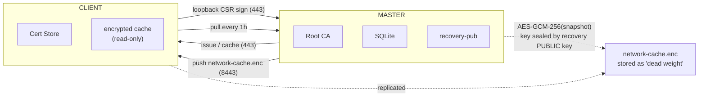

# NATSSL

**Zero-Configuration Distributed TLS for Private Infrastructure.**

A single binary acting as a Certificate Authority (Root CA) for private
networks, with disaster recovery via a 24-word BIP-39 seed phrase — no mDNS,
no cloud.


---

## Table of Contents
- [Features](#features)
- [Architecture](#architecture)
- [Requirements](#requirements)
- [Building](#building)
- [Quick Start](#quick-start)
- [Issuing a Certificate as a Client (CSR-flow)](#issuing-a-certificate-as-a-client-csr-flow)
- [Configuration](#configuration)
- [Disaster Recovery](#disaster-recovery)
- [Security](#security)
- [Command Reference](#command-reference)
- [License](#license)

---

## Features

| Category | Capabilities |
|---|---|
| **Master** | Bootstrap Root CA (10y), issue any cert, sign loopback CSRs, replicated AES-GCM-256 cache |
| **Client** | Auto-install Root CA into OS and Firefox, **issue loopback certs for itself**, ReadOnly mode when the master is down |
| **DR** | 24-word seed (BIP-39), promote-to-master restoring the *identical* fingerprint |
| **Network** | IPv4/IPv6, static discovery, ports `443` (ACME) and `8443` (mTLS) |
| **Localhost** | Certificates for `127.0.0.1`/`::1`/`localhost` valid 1 year, *Same-PC only*, private key encrypted with a password |

---

## Architecture



On disaster, a client holding the seed phrase decrypts the cache and becomes
the master **with the same serial number and SHA-256 fingerprint** of the
Root CA.

---

## Requirements

- **Go 1.22+** (for building)
- Linux: Ubuntu/Debian/CentOS/RHEL/Rocky
- For Firefox integration: `certutil`
  - Debian/Ubuntu: `apt-get install libnss3-tools`
  - RHEL/Rocky/CentOS: `dnf install nss-tools`

---

## Building

```bash
# Cross-compile for amd64 + arm64
make release
# or without make:
./build.sh
```

Output:

```
dist/
├── natssl-1.0.0-oss-linux-amd64.tar.gz
├── natssl-1.0.0-oss-linux-arm64.tar.gz
└── SHA256SUMS.txt
```

Pack the entire source tree into an archive:

```bash
./pack.sh     # -> natssl-src.tar.gz
```

Install the binary:

```bash
tar -xzf natssl-1.0.0-oss-linux-amd64.tar.gz
sudo install -m 0755 natssl-1.0.0-oss-linux-amd64 /usr/local/bin/natssl
natssl --version
```

---

## Quick Start

### Master

```bash
sudo natssl --mode=master --bootstrap
# Write down the 24 words OFFLINE — they are shown only ONCE!

sudo systemctl enable --now natssl-master
sudo natssl --mode=master --issue "app.internal"
```

### Client

Copy `recovery_public_key` and `master_address` into `/etc/natssl/config.yaml`:

```bash
sudo systemctl enable --now natssl-client
```

---

## Issuing a Certificate as a Client (CSR-flow)

> **Hard rule:** a client can issue certificates **only for loopback**
> (`localhost`, `127.0.0.1`, `::1`). Any other domain or IP is **rejected** —
> both locally (before contacting the master) and on the master (HTTP 403).
>
> Certificates for real domains/IPs are issued **only by the administrator**
> on the master via `natssl --mode=master --issue "..."`.

| Requester | Allowed targets |
|---|---|
| **Client** (`--mode=client --issue`) | `localhost`, `127.0.0.1`, `::1` only |
| **Admin** (`--mode=master --issue`) | any `*.internal` / `*.local` / IP / domain |

The leaf private key is generated **locally** on the client and never leaves
the machine; only the public part travels inside the CSR.

### Allowed (client)

```bash
sudo natssl --mode=client --issue "localhost" --localhost
sudo natssl --mode=client --issue "127.0.0.1"
# ↳ you will be prompted for a password to encrypt the private key
```

Result:

```
✔ Loopback certificate issued for "localhost"
  cert: /var/lib/natssl/issued/localhost.crt
  key : /var/lib/natssl/issued/localhost.key.enc  (encrypted, this PC only)
```

### Rejected (client)

```bash
sudo natssl --mode=client --issue "dev.internal"   # -> error: loopback only
sudo natssl --mode=client --issue "192.168.10.20"  # -> error: loopback only
```

### Decrypt the private key for use

```bash
natssl --mode=client \
  --decrypt-key=/var/lib/natssl/issued/localhost.key.enc > /tmp/localhost.key
chmod 600 /tmp/localhost.key
```

Use it in a dev server (Go example):

```go
cert, _ := tls.LoadX509KeyPair(
    "/var/lib/natssl/issued/localhost.crt",
    "/tmp/localhost.key",
)
srv := &http.Server{
    Addr:      ":8443",
    TLSConfig: &tls.Config{Certificates: []tls.Certificate{cert}},
}
```

The browser already trusts the certificate — the Root CA was installed by the
client into the OS and Firefox.

> ⚠️ If the master is unreachable, issuing new certificates is **blocked**
> (ReadOnly). Previously issued certificates keep working until they expire.

---

## Configuration

`/etc/natssl/config.yaml`:

```yaml
mode: client
data_dir: /var/lib/natssl
listen:
  acme: ":443"
  mgmt: ":8443"
master_address: "192.168.10.5"
recovery_public_key: ""    # auto-filled on the master during bootstrap
clients:
  - "192.168.10.20"
  - "192.168.10.21"
pull_interval: 1h
ping_interval: 5m
```

---

## Disaster Recovery

```bash
sudo natssl --mode=client --promote-to-master \
  --token="word1 word2 ... word24"
```

A mandatory **safety chain** runs before activation:

1. TCP health-check of the old master (`443`/`8443`) → alive → **abort**.
2. ICMP + ARP (`/proc/net/arp`) → responds → **block**.
3. Local IP conflict with the old master → **block**.

See [docs/DEPLOYMENT.md](docs/DEPLOYMENT.md) for details.

---

## Security

- The recovery private key is **never written to disk** on the master.
- The network cache is encrypted with AES-GCM-256; the symmetric key is sealed
  with the recovery public key (NaCl SealedBox) → the client cannot decrypt it.
- **Clients can only obtain loopback certificates** — enforced both client-side
  and on the master (HTTP 403). This prevents a client from impersonating any
  other host on the trusted network.
- The client certificate's private key **never leaves the machine** (CSR-flow)
  and is stored encrypted (scrypt N=2¹⁵ + AES-GCM-256) under the user's password.
- Migration packets are signed with the Root CA key and verified by clients.

> ⚠️ In the OSS version the cache-distribution transport is simplified
> (`InsecureSkipVerify`). For production, enable Root CA pinning and strict
> mTLS — see the "Hardening" section in `docs/DEPLOYMENT.md`.

---

## Command Reference

| Command | Purpose |
|---|---|
| `natssl --mode=master --bootstrap` | Initialize Root CA + seed phrase |
| `natssl --mode=master` | Run the master (443 + 8443) |
| `natssl --mode=master --issue "X" [--localhost]` | Issue any cert (master generates the key) |
| `natssl --mode=client` | Run the client (install CA, ping, receive cache) |
| `natssl --mode=client --issue "localhost"` | **Issue a loopback cert for yourself** (CSR-flow) |
| `natssl --mode=client --decrypt-key=FILE` | Decrypt a `.key.enc` to stdout |
| `natssl --mode=client --promote-to-master --token="..."` | Disaster-recovery promotion |
| `natssl --version` | Show version |

---

## License

Apache-2.0 (OSS version). Clustering (Raft, N>1 masters) is part of the
commercial edition.
