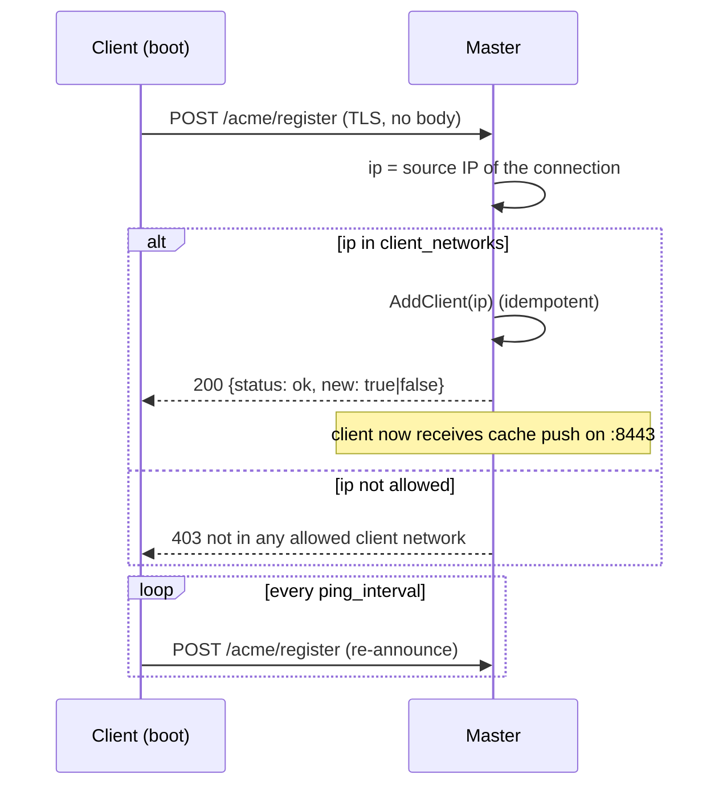
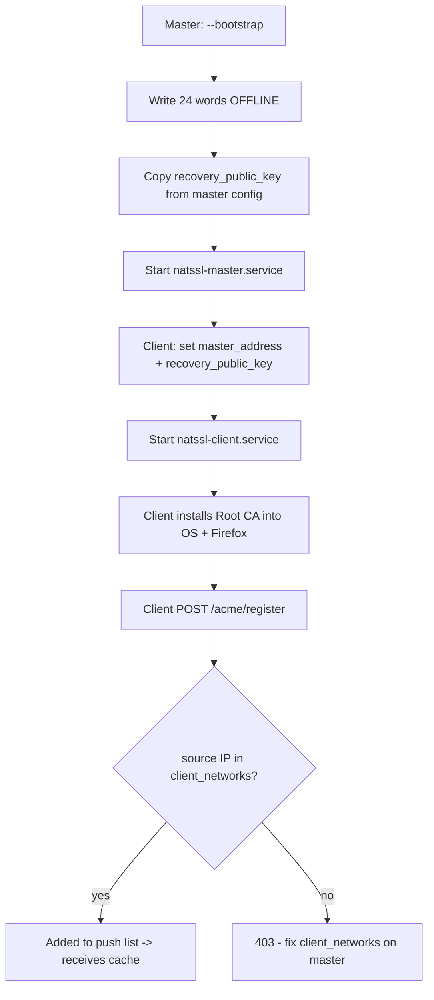
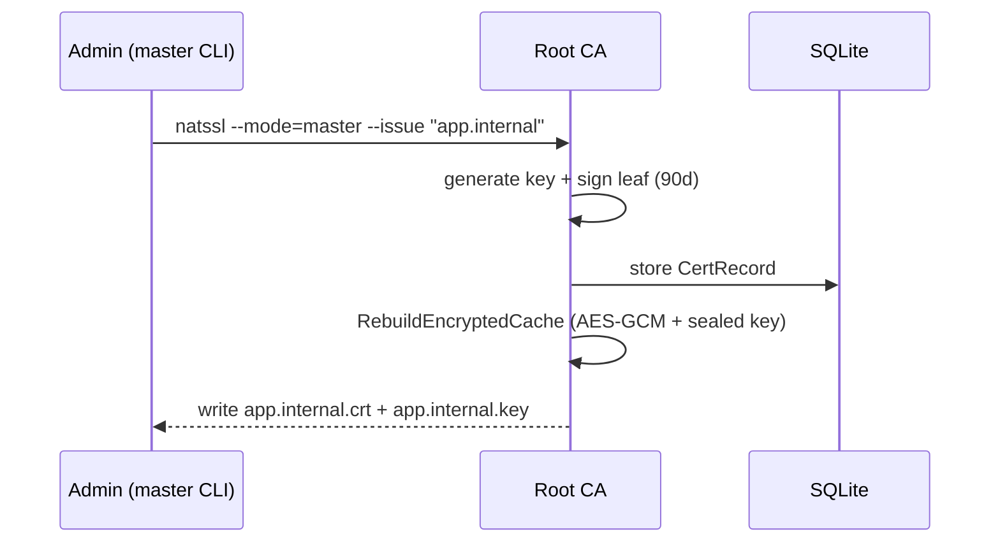
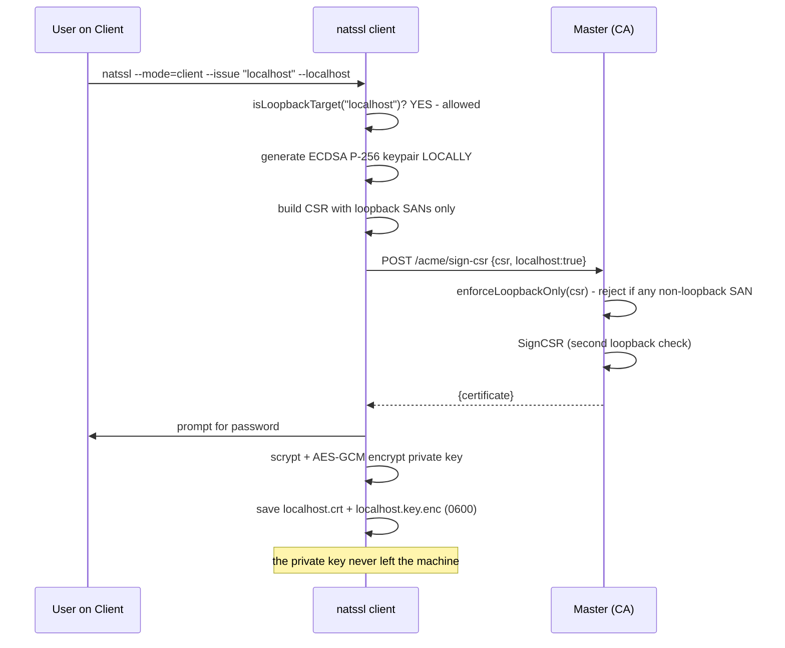
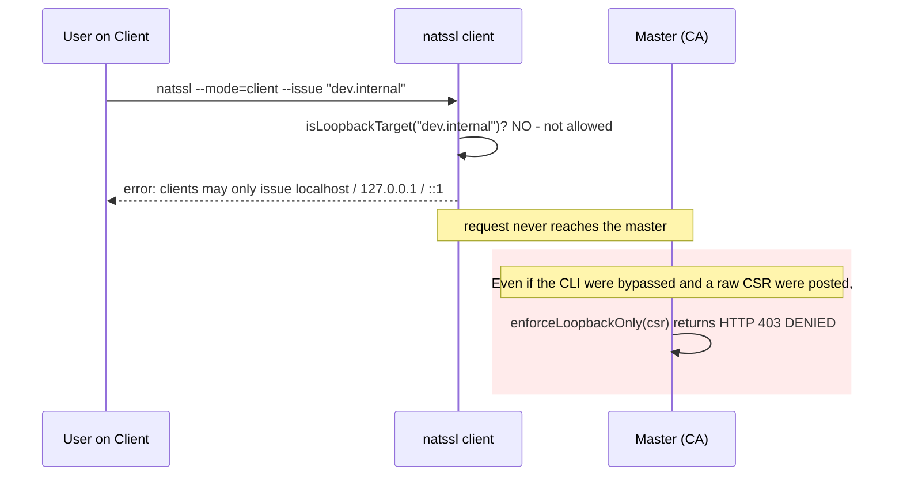

# NATSSL — Deployment Guide

## 1. Topology

| Role | Count (OSS) | Ports | Privileges |
|---|---|---|---|
| Master | **1** (Raft disabled) | 443, 8443 | root (bind <1024, CAP_NET_RAW) |
| Client | N | 8443 (receive push) | root (CA installation) |

---

## 2. Authorization Model

NATSSL enforces a strict separation between who may issue what:

| Requester | Mechanism | Allowed targets |
|---|---|---|
| **Administrator** | `natssl --mode=master --issue "..."` (local CLI, bypasses HTTP) | **Any** `*.internal` / `*.local` / IP / domain |
| **Client** | `natssl --mode=client --issue "..."` → CSR-flow to master | **Loopback only**: `localhost`, `127.0.0.1`, `::1` |

> **Why loopback-only for clients?**
> All machines on the network trust the single Root CA. If a client could
> obtain a certificate for an arbitrary host (e.g. `gateway.internal` or
> another node's IP), it could impersonate that host and perform MITM attacks.
> Restricting clients to loopback makes any client-issued certificate useless
> anywhere except the requesting machine itself.

The rule is enforced **twice** (defense in depth):

1. **Client-side** (`isLoopbackTarget` in `client_issue.go`) — rejects
   non-loopback targets before a request ever leaves the machine.
2. **Master-side** (`enforceLoopbackOnly` in `server.go`) — returns **HTTP 403**
   for any CSR whose SANs are not strictly loopback, even if the client was
   bypassed or tampered with.

A third backstop lives in `ca.go` (`SignCSR` validates loopback-only whenever
`localhost=true`).

### 2.1 Client Auto-Registration

Clients are **not** listed by hand. The master trusts one or more CIDR ranges;
any client whose source IP falls inside a range registers itself on startup
(`register.go` → `/acme/register` on the master in `server.go`).



**Master config:**

```yaml
client_networks:
  - "192.168.10.0/24"
  - "10.0.0.0/16"
```

> If `client_networks` is empty, **no client can self-register** and the master
> logs a warning at startup. Use the optional static `clients:` list only for
> special cases. Authorization is by **source IP** — see §7 for hardening.

---

## 3. Installing from a Release

```bash
ARCH=$(uname -m); case "$ARCH" in
  x86_64) A=amd64;; aarch64|arm64) A=arm64;; esac

tar -xzf natssl-1.0.0-oss-linux-$A.tar.gz
sudo install -m0755 natssl-1.0.0-oss-linux-$A /usr/local/bin/natssl
sudo mkdir -p /etc/natssl /var/lib/natssl
```

Firefox dependencies:

```bash
# Debian/Ubuntu
sudo apt-get install -y libnss3-tools ca-certificates
# RHEL/Rocky/CentOS
sudo dnf install -y nss-tools
```

Install the matching config example as `/etc/natssl/config.yaml`:

```bash
# on the master
sudo cp config.master.yaml /etc/natssl/config.yaml
# on a client
sudo cp config.client.yaml /etc/natssl/config.yaml
```

---

## 4. systemd

`natssl-master.service`:

```ini
[Unit]
Description=NATSSL Master (Private CA)
After=network-online.target
Wants=network-online.target

[Service]
ExecStart=/usr/local/bin/natssl --mode=master --config=/etc/natssl/config.yaml
Restart=on-failure
AmbientCapabilities=CAP_NET_BIND_SERVICE CAP_NET_RAW
NoNewPrivileges=true

[Install]
WantedBy=multi-user.target
```

`natssl-client.service`:

```ini
[Unit]
Description=NATSSL Client (Cert Store)
After=network-online.target
Wants=network-online.target

[Service]
ExecStart=/usr/local/bin/natssl --mode=client --config=/etc/natssl/config.yaml
Restart=on-failure
AmbientCapabilities=CAP_NET_BIND_SERVICE CAP_NET_RAW

[Install]
WantedBy=multi-user.target
```

```bash
sudo systemctl daemon-reload
sudo systemctl enable --now natssl-master   # or natssl-client
```

---

## 5. End-to-End Rollout



Verify a client joined:

```bash
journalctl -u natssl-master | grep "client registered"
# client registered: 192.168.10.20
```

---

## 6. Certificate Lifecycle

### 6.1 Administrator issues any cert on the master (`--issue`)

The master generates both the key and the certificate locally via the CLI —
this path bypasses the HTTP authorization layer and can target any name.



### 6.2 Client issues a LOOPBACK cert for itself (`/acme/sign-csr`)



### 6.3 Client requests a NON-loopback target — DENIED



---

## 7. Disaster Scenario (DR)


### Verifying fingerprint identity

```bash
openssl x509 -in /var/lib/natssl/root-ca.crt -noout -fingerprint -sha256
# the value matches before and after promotion
```

---

## 8. Hardening (Production)

| Risk | Action |
|---|---|
| `InsecureSkipVerify` in transport | Replace with `RootCAs` and Root CA pinning |
| `/cache/push` without mTLS | Require a client certificate signed by the Root CA |
| `/acme/sign-csr` without auth | Loopback-only is enforced, but it is **unauthenticated**; add mTLS or one-time enrollment tokens so only known clients can request even loopback certs |
| `/acme/register` via source IP | Source IP is spoofable on a flat L2 segment. For production, gate registration behind a one-time enrollment token or mTLS so only known clients can join the push list |
| Source-IP trust | Do not rely on source IP for authorization beyond coarse network gating — use mTLS identity instead |
| localhost private key | scrypt(N=2¹⁵)+AES-GCM is **already enabled**; keep the password off the node |
| seed phrase | store offline (paper/HSM), not in a password manager on the node |
| file permissions | `root-ca.key`, `*.key.enc`, `network-cache.enc` → `0600` (already set) |

> **Note on the loopback rule:** `enforceLoopbackOnly` prevents *privilege
> escalation* (a client cannot obtain a cert for another host), but it does
> **not** authenticate *which* client is asking. Likewise, `/acme/register`
> only gates by network. For production, gate both endpoints behind mTLS so
> only enrolled clients can call them.

---

## 9. Diagnostics

```bash
# Master reachability
nc -vz 192.168.10.5 443
nc -vz 192.168.10.5 8443

# Logs
journalctl -u natssl-master -f
journalctl -u natssl-client -f

# Auto-registration
journalctl -u natssl-master | grep "client registered"     # accepted
journalctl -u natssl-master | grep "DENIED registration"    # rejected (CIDR)
journalctl -u natssl-client  | grep "self-registration"     # client side

# Denied CSRs on the master
journalctl -u natssl-master | grep "DENIED CSR"

# Registered clients (over mTLS on :8443)
# (served by /sync/clients)

# Root CA in the OS
trust list | grep -A2 NATSSL                              # RHEL family
ls -l /usr/local/share/ca-certificates/natssl-root.crt    # Debian family

# Root CA in a Firefox profile
certutil -L -d sql:$HOME/.mozilla/firefox/<profile> | grep NATSSL

# Inspect a client-issued (loopback) certificate
openssl x509 -in /var/lib/natssl/issued/localhost.crt -noout -text | \
  grep -A2 "Subject Alternative Name"
# Expect ONLY: DNS:localhost, IP:127.0.0.1, IP:::1
```

---

## 10. Common Errors

### Client never appears in the push list

The master rejected registration. Check:

```bash
journalctl -u natssl-master | grep "DENIED registration"
# DENIED registration from 192.168.99.7 (not in client_networks)
```

Fix `client_networks` on the master to include the client's subnet, then
restart the master. The client retries automatically every `ping_interval`.

### "registration rejected (403): your IP is not in any allowed client network"

Same cause, seen from the client side. The client's source IP is outside every
configured CIDR. Either widen `client_networks` or move the client.

### "clients may only issue certificates for localhost / 127.0.0.1 / ::1"

**Expected** — the client tried to request a non-loopback target. Domains/IPs
must be issued by the administrator on the master:

```bash
sudo natssl --mode=master --issue "dev.internal"
```

### "master rejected request: clients may only request 'localhost' ..." (HTTP 403)

The master refused a CSR whose SANs were not strictly loopback. This is the
server-side backstop firing. Check `journalctl -u natssl-master | grep DENIED`
to see the offending peer.

### "issue failed: master is OFFLINE"

**Expected** (ReadOnly). The client cannot issue while the master is
unreachable. Options:

1. Bring the master back up.
2. If the master is physically lost — run `--promote-to-master`.
3. Already-issued certificates keep working until they expire.

---

## 11. FAQ

**Do I still need to list clients by hand?**
No. Set `client_networks` on the master and `master_address` on each client.
Clients self-register on startup and re-register every `ping_interval`.

**Why doesn't the client sign on its own?**
Trust is built on a single Root CA. Distributing its key to every machine
would compromise the entire network. The CSR-flow keeps signing centralized
while the leaf private key stays on the client.

**Why can a client only issue loopback certificates?**
To prevent host impersonation. A loopback certificate is useless anywhere
except the requesting machine, so a compromised or malicious client cannot use
the shared Root CA to MITM other hosts. Real domain/IP certificates are an
administrator action on the master.

**What if the seed phrase is lost?**
Recovery is impossible — there is nothing to decrypt the cache with. This is
by design.

**Why can't the Root CA be regenerated with the same fingerprint without a backup?**
The SHA-256 fingerprint is the hash of the DER encoding (including the
non-deterministic ECDSA signature). The only correct approach is a
byte-for-byte restore from the encrypted recovery cache.
