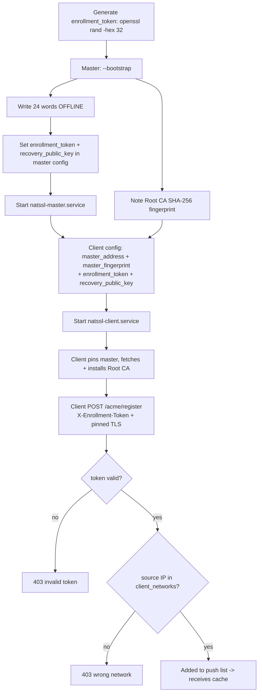
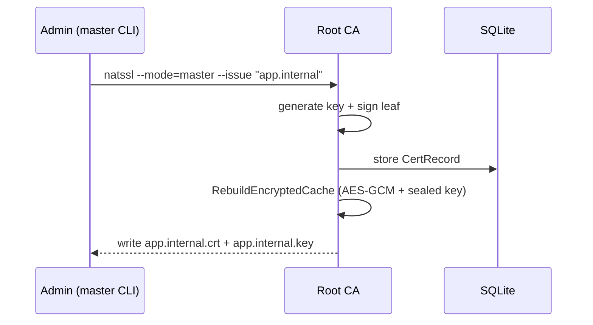
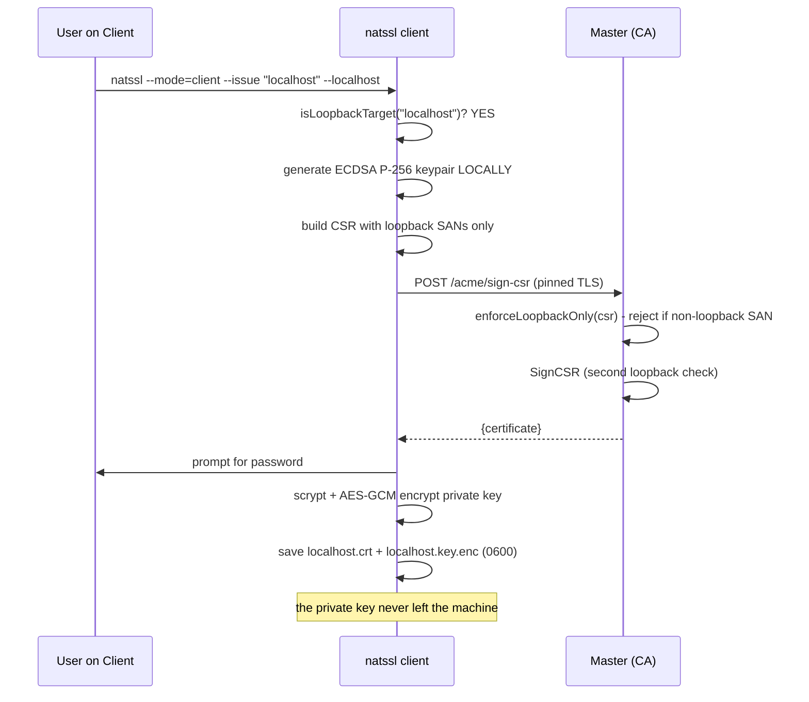
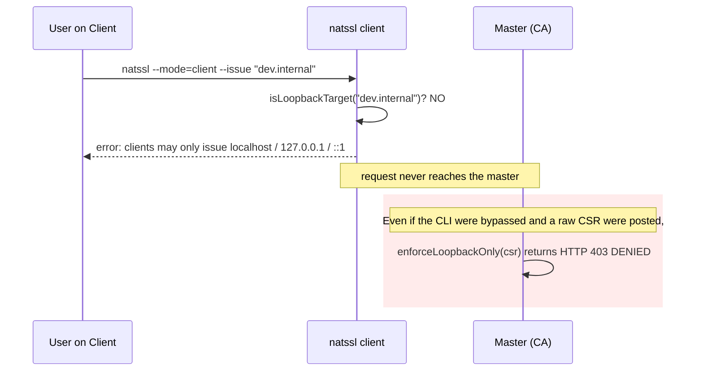

# NATSSL — Deployment Guide

## 1. Topology

| Role | Count (OSS) | Ports | Privileges |
|---|---|---|---|
| Master | **1** (Raft disabled) | 443, 8443 | root (bind <1024, CAP_NET_RAW) |
| Client | N | 8443 (receive push) | root (CA installation) |

---

## 2. Security Controls

NATSSL applies three independent controls. Understand each before deploying.

### 2.1 Enrollment Token (anti-spoofing)

Self-registration is gated by a **shared secret** sent in the
`X-Enrollment-Token` header and compared on the master in constant time
(`subtle.ConstantTimeCompare`). This defeats IP spoofing on flat L2 segments:
a spoofed source IP alone is useless without the token.

```bash
# Generate once; put the SAME value on the master and every client.
openssl rand -hex 32
```

```yaml
# master + client
enrollment_token: "9f1c...the-hex-value..."
```

> If `enrollment_token` is empty on the master, it logs a startup warning and
> falls back to **CIDR-only** authorization (spoofable). Always set it in
> production.

### 2.2 Root CA Pinning (transport)

The client→master path (`/ca`, `/cache`, `/acme/register`, `/acme/sign-csr`)
is authenticated by **pinning the master's Root CA** instead of using
`InsecureSkipVerify`. Verification order (`verifyMasterPin` in `netutil.go`):

1. **Fingerprint pin** — if `master_fingerprint` is set, the master's presented
   certificate must match that SHA-256 exactly. Works even before the CA is on
   disk (solves the bootstrap chicken-and-egg).
2. **Chain pin** — otherwise, if the local Root CA file exists, the presented
   cert must chain to it.
3. **Fail-closed** — if neither is available, the connection is **refused**.

```yaml
# client
master_fingerprint: "AB:CD:EF:...:99"   # colons optional, case-insensitive
```

```bash
# Obtain the fingerprint (also printed at master bootstrap):
openssl x509 -in /var/lib/natssl/root-ca.crt -noout -fingerprint -sha256
```

> The `InsecureSkipVerify: true` you may see in `pinnedMasterClient` only
> disables the **hostname** check (the Root CA cert has no SAN for the master's
> IP). The actual identity check is enforced in `VerifyPeerCertificate`. This
> is the standard certificate-pinning pattern, not a bypass.

### 2.3 Loopback-Only Client Issuance

| Requester | Mechanism | Allowed targets |
|---|---|---|
| **Administrator** | `natssl --mode=master --issue "..."` (local CLI, bypasses HTTP) | **Any** domain / IP |
| **Client** | `natssl --mode=client --issue "..."` → CSR-flow to master | **Loopback only** |

Enforced **twice**:

1. **Client-side** (`isLoopbackTarget` in `client_issue.go`) — rejects
   non-loopback targets before any request leaves the machine.
2. **Master-side** (`enforceLoopbackOnly` in `server.go`) — returns **HTTP 403**
   for any CSR whose SANs are not strictly loopback.

A third backstop lives in `ca.go` (`SignCSR`).

> **Why loopback-only?** All machines trust one Root CA. If a client could
> obtain a cert for an arbitrary host, it could impersonate it and MITM.
> Loopback certs are useless anywhere except the requesting machine.

---

## 3. Installing from a Release

```bash
ARCH=$(uname -m); case "$ARCH" in
  x86_64) A=amd64;; aarch64|arm64) A=arm64;; esac

tar -xzf natssl-1.0.0-oss-linux-$A.tar.gz
sudo install -m0755 natssl-1.0.0-oss-linux-$A /usr/local/bin/natssl
sudo mkdir -p /etc/natssl /var/lib/natssl
```

Firefox dependencies:

```bash
# Debian/Ubuntu
sudo apt-get install -y libnss3-tools ca-certificates
# RHEL/Rocky/CentOS
sudo dnf install -y nss-tools
```

Install the matching config example as `/etc/natssl/config.yaml`:

```bash
# on the master
sudo cp config.master.yaml /etc/natssl/config.yaml
# on a client
sudo cp config.client.yaml /etc/natssl/config.yaml
```

> The build is pure-Go (`modernc.org/sqlite`, `CGO_ENABLED=0`) — the binary has
> no shared-library dependencies beyond libc.

---

## 4. systemd

`natssl-master.service`:

```ini
[Unit]
Description=NATSSL Master (Private CA)
After=network-online.target
Wants=network-online.target

[Service]
ExecStart=/usr/local/bin/natssl --mode=master --config=/etc/natssl/config.yaml
Restart=on-failure
AmbientCapabilities=CAP_NET_BIND_SERVICE CAP_NET_RAW
NoNewPrivileges=true

[Install]
WantedBy=multi-user.target
```

`natssl-client.service`:

```ini
[Unit]
Description=NATSSL Client (Cert Store)
After=network-online.target
Wants=network-online.target

[Service]
ExecStart=/usr/local/bin/natssl --mode=client --config=/etc/natssl/config.yaml
Restart=on-failure
AmbientCapabilities=CAP_NET_BIND_SERVICE CAP_NET_RAW

[Install]
WantedBy=multi-user.target
```

```bash
sudo systemctl daemon-reload
sudo systemctl enable --now natssl-master   # or natssl-client
```

---

## 5. End-to-End Rollout



Verify a client joined:

```bash
journalctl -u natssl-master | grep "client registered"
# client registered: 192.168.10.20
```

---

## 6. Certificate Lifecycle

### 6.1 Administrator issues any cert on the master (`--issue`)

The master generates both the key and the certificate locally via the CLI —
this path bypasses the HTTP authorization layer and can target any name.



### 6.2 Client issues a LOOPBACK cert for itself (`/acme/sign-csr`)



### 6.3 Client requests a NON-loopback target — DENIED



---

## 7. Disaster Scenario (DR)


> Because the Root CA is restored **byte-for-byte**, its SHA-256 fingerprint is
> unchanged — so every client's existing `master_fingerprint` pin keeps working
> after promotion. **Only `master_address` needs updating** on clients (the
> signed migration broadcast handles this automatically).

### Verifying fingerprint identity

```bash
openssl x509 -in /var/lib/natssl/root-ca.crt -noout -fingerprint -sha256
# matches the value before and after promotion (and the clients' master_fingerprint)
```

---

## 8. Hardening (Production)

| Risk | Status / Action |
|---|---|
| Client→master transport | ✅ **Root CA pinned** (`master_fingerprint` or chain). Always set `master_fingerprint`. |
| Self-registration spoofing | ✅ **Enrollment token** required. Always set `enrollment_token`. |
| Client privilege escalation | ✅ **Loopback-only** enforced client- and server-side. |
| `/acme/sign-csr` authentication | ⚠️ Loopback-only is enforced, but the endpoint is **not** authenticated per-client. Add mTLS or one-time tokens so only known clients can request even loopback certs. |
| `/acme/register` token sharing | ⚠️ The token is **shared** — one leaked client leaks it for all. Rotate periodically; the clean fix is per-client mTLS identities (commercial edition). |
| `/cache/push` (master→client, :8443) | ⚠️ Not mutually authenticated. Payload is AES-GCM-encrypted + sealed (no plaintext exposure), but enabling strict mTLS on this direction is recommended. |
| localhost private key | ✅ scrypt(N=2¹⁵)+AES-GCM enabled; keep the password off the node. |
| seed phrase | Store offline (paper/HSM), not in a password manager on the node. |
| file permissions | `root-ca.key`, `*.key.enc`, `network-cache.enc` → `0600` (already set). |
| token in config file | `chmod 600 /etc/natssl/config.yaml` so the shared secret isn't world-readable. |

> **Layered defense summary:** the enrollment token authenticates *that a peer
> is allowed to enroll*; CIDR coarsely gates *where* it may come from; pinning
> authenticates *the master*; loopback-only limits *what a client can mint*.
> None of these authenticates *which specific* client is calling — that
> requires per-client mTLS identities.

---

## 9. Diagnostics

```bash
# Master reachability
nc -vz 192.168.10.5 443
nc -vz 192.168.10.5 8443

# Logs
journalctl -u natssl-master -f
journalctl -u natssl-client -f

# Startup security posture (master)
journalctl -u natssl-master | grep -E "enrollment|auto-registration|WARNING"

# Auto-registration outcomes
journalctl -u natssl-master | grep "client registered"            # accepted
journalctl -u natssl-master | grep "invalid/missing enrollment"   # bad token
journalctl -u natssl-master | grep "not in client_networks"       # bad CIDR
journalctl -u natssl-client | grep "self-registration"            # client side

# Pinning failures (client)
journalctl -u natssl-client | grep -i "fingerprint mismatch\|does not chain\|cannot verify master"

# Denied CSRs on the master
journalctl -u natssl-master | grep "DENIED CSR"

# Root CA in the OS
trust list | grep -A2 NATSSL                              # RHEL family
ls -l /usr/local/share/ca-certificates/natssl-root.crt    # Debian family

# Root CA in a Firefox profile
certutil -L -d sql:$HOME/.mozilla/firefox/<profile> | grep NATSSL

# Inspect a client-issued (loopback) certificate
openssl x509 -in /var/lib/natssl/issued/localhost.crt -noout -text | \
  grep -A2 "Subject Alternative Name"
# Expect ONLY: DNS:localhost, IP:127.0.0.1, IP:::1
```

---

## 10. Common Errors

### "registration rejected (403): invalid or missing enrollment token"

The client's `enrollment_token` does not match the master's. Ensure the **same
value** is set on both, then restart the client (it retries every
`ping_interval`).

```bash
grep enrollment_token /etc/natssl/config.yaml   # compare on master and client
```

### "registration rejected (403): your IP is not in any allowed client network"

The token was accepted but the client's source IP is outside every
`client_networks` CIDR. Widen `client_networks` on the master (and restart it),
or move the client.

```bash
journalctl -u natssl-master | grep "not in client_networks"
# DENIED registration from 192.168.99.7 (not in client_networks)
```

### "master certificate fingerprint mismatch"

The master's Root CA does not match the client's `master_fingerprint`. Either:

- the value is wrong/stale → re-copy it from
  `openssl x509 -in root-ca.crt -noout -fingerprint -sha256`, **or**
- you are talking to a **rogue master** → investigate. Pinning just protected you.

### "cannot verify master: set master_fingerprint in config or install the Root CA locally first"

Neither a fingerprint pin nor a local Root CA is available, so the client
**fails closed**. Set `master_fingerprint` in the client config (recommended)
or pre-seed `root-ca.crt` out-of-band.

### "clients may only issue certificates for localhost / 127.0.0.1 / ::1"

**Expected** — the client tried a non-loopback target. Use the master:

```bash
sudo natssl --mode=master --issue "dev.internal"
```

### "master rejected request: clients may only request 'localhost' ..." (HTTP 403)

The server-side backstop fired (`enforceLoopbackOnly`). Check
`journalctl -u natssl-master | grep "DENIED CSR"` for the offending peer.

### "issue failed: master is OFFLINE"

**Expected** (ReadOnly). The client cannot issue while the master is
unreachable. Bring the master back, or `--promote-to-master` if it is lost.
Already-issued certificates keep working until they expire.

---

## 11. FAQ

**Do I still need to list clients by hand?**
No. Set `client_networks` + `enrollment_token` on the master, and
`master_address` + `master_fingerprint` + `enrollment_token` on each client.
Clients self-register on startup and re-register every `ping_interval`.

**What stops a random host from registering?**
Two gates: it needs the shared **enrollment token** *and* a source IP inside
`client_networks`. The token defeats IP spoofing on a flat L2 segment.

**What stops a fake master from impersonating the real one?**
**Root CA pinning.** The client verifies the master's certificate against
`master_fingerprint` (or that it chains to the installed Root CA) and fails
closed otherwise.

**Why can a client only issue loopback certificates?**
To prevent host impersonation. A loopback cert is useless anywhere except the
requesting machine. Real domain/IP certs are an administrator action on the
master.

**Can I rotate the enrollment token?**
Yes — change it on the master and on all clients. Clients re-register on the
next `ping_interval`. Because it is shared, rotate after any client compromise.

**What if the seed phrase is lost?**
Recovery is impossible — there is nothing to decrypt the cache with. By design.

**Why can't the Root CA be regenerated with the same fingerprint without a backup?**
The SHA-256 fingerprint is the hash of the DER encoding (including the
non-deterministic ECDSA signature). The only correct approach is a
byte-for-byte restore from the encrypted recovery cache.
