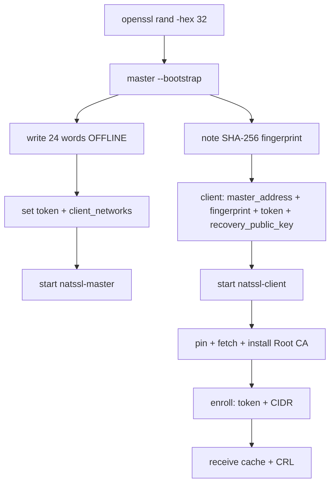
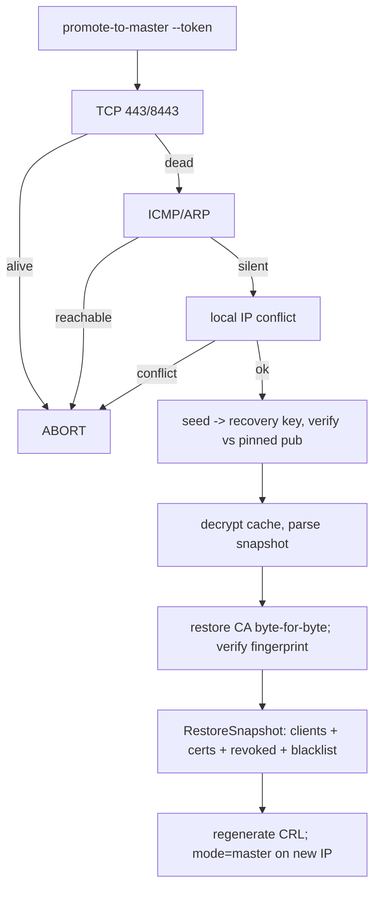

# NATSSL — Deployment Guide

## 1. Topology

| Role | Count (OSS) | Ports | Notes |
|---|---|---|---|
| Master | 1 | 443 (API), 8443 (control) | Root CA signs certs + CRL |
| Client | N | 8443 (cache/CRL receiver) | Self-enrolls via token + CIDR |

---

## 2. Security Controls

<details open>
<summary>2.1 Enrollment token</summary>

`openssl rand -hex 32` — same value on master + every client; compared in
constant time via `X-Enrollment-Token`.
</details>

<details>
<summary>2.2 Root CA pinning</summary>

`verifyMasterPin`: (1) fingerprint match if `master_fingerprint` set; else
(2) chain to local Root CA; else (3) fail closed.
</details>

<details>
<summary>2.3 Issuance authorization</summary>

| Path | Who | Targets |
|---|---|---|
| `--issue` / `--reissue` | Admin on master | any domain / IP / wildcard |
| `/acme/sign-csr` | Enrolled client | loopback only (enforced twice) |
</details>

<details>
<summary>2.4 Blacklist</summary>

`--block <IP>` → `/acme/register` denies that IP (403) regardless of
token/CIDR. Immediate (same DB). `--unblock` reverses it.
</details>

---

## 3. Install

```bash
ARCH=$(uname -m); case "$ARCH" in x86_64) A=amd64;; aarch64|arm64) A=arm64;; esac
tar -xzf natssl-1.0.8-oss-linux-$A.tar.gz
sudo install -m0755 natssl-1.0.8-oss-linux-$A /usr/local/bin/natssl
sudo mkdir -p /etc/natssl /var/lib/natssl
sudo apt-get install -y libnss3-tools ca-certificates   # Debian/Ubuntu
sudo dnf install -y nss-tools                            # RHEL/Rocky
sudo cp config.<role>.yaml /etc/natssl/config.yaml
sudo chmod 600 /etc/natssl/config.yaml
```

---

## 4. systemd

```bash
sudo cp natssl-*.service /etc/systemd/system/
sudo systemctl daemon-reload
sudo systemctl enable --now natssl-master   # or natssl-client
```

---

## 5. Rollout



---

## 6. Certificate Lifecycle

### 6.1 Admin issuance (master)
```bash
sudo natssl --mode=master --issue "app.internal"
sudo natssl --mode=master --issue "192.168.1.2"
sudo natssl --mode=master --issue "*.internal"
```
Files: `/var/lib/natssl/issued/<subject>.{crt,key}` (key `0600`); 90 days
(`--localhost` ⇒ 1 year, loopback SANs).

### 6.2 Reissue / rotate (master)
```bash
sudo natssl --mode=master --reissue "192.168.1.2"
```
Revokes current cert(s) → CRL → issues fresh → overwrites files → **propagates
immediately**.

### 6.3 Client issuance (loopback only)
```bash
sudo natssl --mode=client --issue "localhost" --localhost
natssl --mode=client --decrypt-key=/var/lib/natssl/issued/localhost.key.enc > key.pem
```

### 6.4 Revoke & CRL
```bash
sudo natssl --mode=master --revoke "<serial-hex>"
sudo natssl --mode=master --list-revoked
openssl crl -in /var/lib/natssl/root-ca.crl -noout -text
```
Records the serial, regenerates the **signed X.509 CRL** (`root-ca.crl`),
rebuilds the cache, and **pushes both to clients now** (also pullable from
`/crl`). Regenerated on bootstrap and on master start too.

### 6.5 Client management
```bash
sudo natssl --mode=master --list-clients
sudo natssl --mode=master --deregister "192.168.10.21"
sudo natssl --mode=master --block "192.168.10.21" --block-reason "decommissioned"
sudo natssl --mode=master --unblock "192.168.10.21"
sudo natssl --mode=master --list-blocked
```

---

## 7. Disaster Recovery



The locally stored `network-cache.enc` carries the **full state**: Root CA,
clients, issued certs, the **revoked set**, and the **blacklist**. A promoted
master is therefore fully functional and knows the last replicated state.

> **Freshness:** equals the client's last successful sync before the master
> died. Revocations/blocks made after that point won't be present. Tune
> `pull_interval` accordingly.

---

## 8. Hardening Status

| Risk | Status |
|---|---|
| Spoofable registration | ✅ Token + CIDR |
| Pin ambiguity | ✅ Pin to Root CA, fail-closed |
| Host impersonation by clients | ✅ Loopback-only (twice) |
| Re-registration of rogue host | ✅ `--block` (immediate) |
| Revocation | ✅ Signed CRL, pushed + pullable, propagated immediately |
| DR completeness | ✅ Snapshot restores certs + revoked + blacklist |
| Shared token | ⚠️ Rotate on compromise |
| Master→client push transport | ⚠️ Unpinned, but cache sealed and CRL signed |

---

## 9. Diagnostics

```bash
journalctl -u natssl-master | grep -i "registered\|signed\|DENIED\|CRL\|pushed"
journalctl -u natssl-client | grep -i "pull\|enroll\|fingerprint\|CRL"
openssl x509 -in /var/lib/natssl/root-ca.crt -noout -fingerprint -sha256
openssl crl  -in /var/lib/natssl/root-ca.crl -noout -text
```

---

## 10. Common Errors

| Message | Fix |
|---|---|
| `invalid or missing enrollment token` (403) | Match the token on both sides. |
| `not in any allowed client network` (403) | Widen `client_networks`. |
| `this client is blacklisted` (403) | `--unblock` to allow. |
| `target not allowed for issuance` | Add a dot, use an IP, or `--localhost`. |
| `certificate %s is already revoked` | Serial already in the CRL. |
| `master certificate does not chain to pinned Root CA` | Wrong/stale fingerprint, or rogue master. |

---

## 11. FAQ

**Reissue vs revoke?** `--revoke <serial>` only revokes. `--reissue <subject>`
revokes the current cert(s) for that subject **and** issues a fresh one, then
propagates immediately.

**Where is the CRL?** `/var/lib/natssl/root-ca.crl`, served at `/crl` (`:443`)
and pushed to `/crl/push` (`:8443`).

**Does a promoted master know about revocations?** Yes — the snapshot includes
revoked serials and the blacklist; the CRL is regenerated on promotion.

