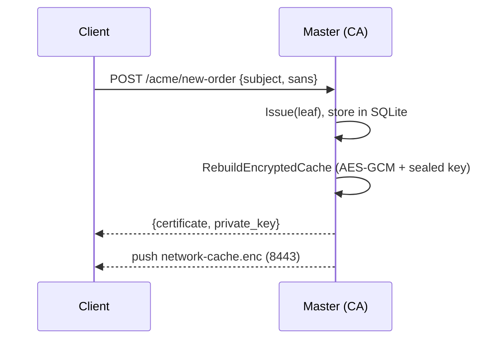
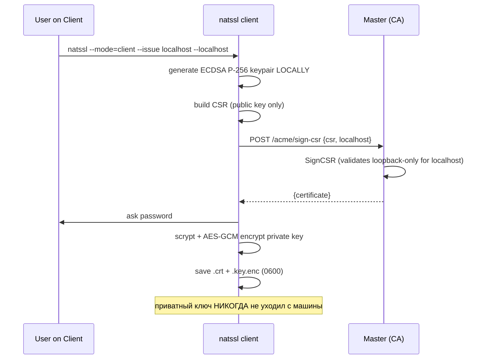
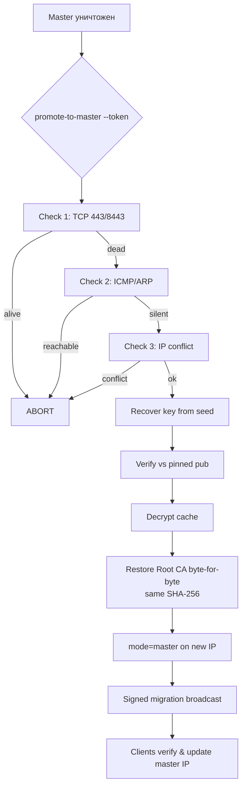

# NATSSL — Руководство по развёртыванию

## 1. Топология

| Роль | Кол-во (OSS) | Порты | Привилегии |
|---|---|---|---|
| Master | **1** (Raft отключён) | 443, 8443 | root (bind <1024, CAP_NET_RAW) |
| Client | N | 8443 (приём push) | root (установка CA) |

---

## 2. Установка из релиза

```bash
ARCH=$(uname -m); case "$ARCH" in
  x86_64) A=amd64;; aarch64|arm64) A=arm64;; esac

tar -xzf natssl-1.0.0-oss-linux-$A.tar.gz
sudo install -m0755 natssl-1.0.0-oss-linux-$A /usr/local/bin/natssl
sudo mkdir -p /etc/natssl /var/lib/natssl
```

Зависимости Firefox:

```bash
# Debian/Ubuntu
sudo apt-get install -y libnss3-tools ca-certificates
# RHEL/Rocky/CentOS
sudo dnf install -y nss-tools
```

---

## 3. systemd

`/etc/systemd/system/natssl-master.service`:

```ini
[Unit]
Description=NATSSL Master (Private CA)
After=network-online.target
Wants=network-online.target

[Service]
ExecStart=/usr/local/bin/natssl --mode=master --config=/etc/natssl/config.yaml
Restart=on-failure
AmbientCapabilities=CAP_NET_BIND_SERVICE CAP_NET_RAW
NoNewPrivileges=true

[Install]
WantedBy=multi-user.target
```

`/etc/systemd/system/natssl-client.service`:

```ini
[Unit]
Description=NATSSL Client (Cert Store)
After=network-online.target
Wants=network-online.target

[Service]
ExecStart=/usr/local/bin/natssl --mode=client --config=/etc/natssl/config.yaml
Restart=on-failure
AmbientCapabilities=CAP_NET_BIND_SERVICE CAP_NET_RAW

[Install]
WantedBy=multi-user.target
```

```bash
sudo systemctl daemon-reload
sudo systemctl enable --now natssl-master   # или natssl-client
```

---

## 4. Жизненный цикл сертификата

### 4.1 Мастер генерирует ключ (`/acme/new-order`)



### 4.2 Клиент выписывает СЕБЕ через CSR (`/acme/sign-csr`)



---

## 5. Сценарий катастрофы (DR)



### Проверка идентичности отпечатка

```bash
openssl x509 -in /var/lib/natssl/root-ca.crt -noout -fingerprint -sha256
# значение совпадает до и после promote
```

---

## 6. Hardening (production)

| Риск | Действие |
|---|---|
| `InsecureSkipVerify` в транспорте | Заменить на `RootCAs` с пиннингом Root CA |
| `/cache/push` без mTLS | Требовать клиентский сертификат, подписанный Root CA |
| `/acme/sign-csr` без аутентификации | Добавить mTLS/одноразовый токен на клиента |
| localhost private key | scrypt(N=2¹⁵)+AES-GCM **уже включено**; храните пароль вне узла |
| seed-фраза | хранить offline (бумага/HSM), не в pass-менеджере на узле |
| права на файлы | `root-ca.key`, `*.key.enc`, `network-cache.enc` → `0600` (задано) |

---

## 7. Диагностика

```bash
# Доступность мастера
nc -vz 192.168.10.5 443
nc -vz 192.168.10.5 8443

# Логи
journalctl -u natssl-master -f
journalctl -u natssl-client -f

# Root CA в системе
trust list | grep -A2 NATSSL                              # RHEL family
ls -l /usr/local/share/ca-certificates/natssl-root.crt    # Debian family

# Root CA в Firefox-профиле
certutil -L -d sql:$HOME/.mozilla/firefox/<profile> | grep NATSSL

# Проверить выписанный клиентом сертификат
openssl x509 -in /var/lib/natssl/issued/localhost.crt -noout -text | \
  grep -A2 "Subject Alternative Name"
```

---

## 8. Типовая ошибка: «issue failed: master is OFFLINE»

Это **ожидаемое** поведение (ReadOnly). Клиент не может выписать новый
сертификат, пока мастер недоступен. Варианты:

1. Поднять мастер.
2. Если мастер физически утрачен — выполнить `--promote-to-master`.
3. Уже выданные сертификаты продолжают работать до конца срока.

---

## 9. FAQ

**Почему клиент не подписывает сам?**
Доверие построено на одном Root CA. Раздать его ключ на все машины =
скомпрометировать всю сеть. CSR-flow: подпись централизована, приватный
ключ листа остаётся у клиента.

**Что если seed-фраза утеряна?**
Восстановление невозможно — кэш расшифровать нечем. Это by design.

**Почему нельзя регенерировать Root CA с тем же fingerprint без бэкапа?**
SHA-256 fingerprint — хеш DER-кодирования (включая недетерминированную
ECDSA-подпись). Корректно только восстановление байт-в-байт из
зашифрованного recovery-кэша.
