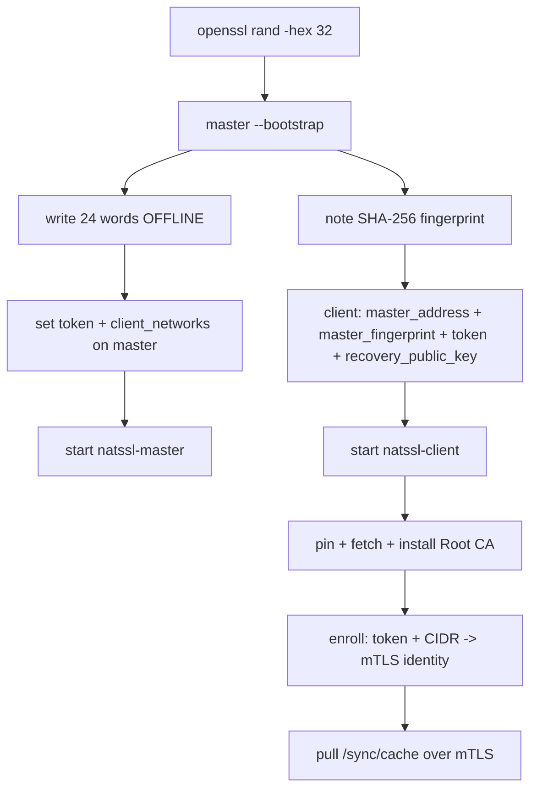
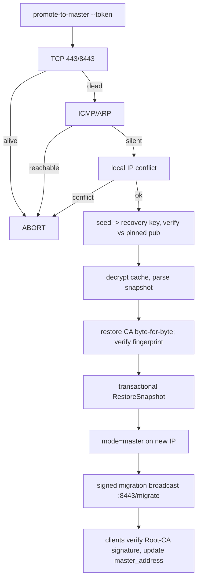

# NATSSL — Deployment Guide (1.0.7)

## 1. Topology

| Role | Count (OSS) | Ports | Notes |
|---|---|---|---|
| Master | 1 | 443 (bootstrap), 8443 (mTLS) | Root CA signs only; TLS via server leaf |
| Client | N | 8443 (migration receiver) | mTLS identity after enrollment |

---

## 2. Security Controls

<details open>
<summary><b>2.1 Enrollment token (mandatory)</b></summary>

Self-registration requires a shared secret in `X-Enrollment-Token`, compared in
constant time. **The master refuses to start** with `client_networks` set but
an empty `enrollment_token` (fail-closed — no silent CIDR-only mode).

```bash
openssl rand -hex 32   # same value on master + every client
```
</details>

<details open>
<summary><b>2.2 Root CA pinning + server leaf (point 2 & 6)</b></summary>

The Root CA key **only signs**. The master serves TLS with a dedicated server
leaf (`server.crt`/`server.key`) issued by the CA; the served chain is
`[leaf‖root]` so pinning clients can verify it during bootstrap.

`verifyMasterPin` pins explicitly to the **Root CA**:
1. If `master_fingerprint` is set, a **CA** cert with that SHA-256 must be in
   the presented chain, and the leaf must chain to it (ServerAuth).
2. Else the leaf must chain to the locally installed Root CA.
3. Else **fail closed**.
</details>

<details open>
<summary><b>2.3 mTLS control plane (point 4)</b></summary>

`:8443` uses `RequireAndVerifyClientCert` with the Root CA as `ClientCAs`. Each
client receives a client-auth identity at enrollment. `/sync/cache`,
`/sync/crl`, and `/acme/sign-csr` are reachable only by authenticated clients.
</details>

<details open>
<summary><b>2.4 Pull-only replication (point 4)</b></summary>

There is **no `/cache/push`**. Clients pull `/sync/cache` and honor a monotonic
`X-Cache-Version`; a version lower than the local one is rejected (anti-replay /
stale protection). Writes are atomic (temp + rename); bodies are size-capped.
</details>

<details>
<summary><b>2.5 Loopback-only client issuance (point 3)</b></summary>

`/acme/new-order` was **removed**. Admin issuance is CLI-only (`RunIssueCLI`,
any target) and never traverses HTTP. Client issuance is loopback-only via
`/acme/sign-csr` over mTLS, enforced by `enforceLoopbackOnly` (server) and
`SignCSR` (CA) — HTTP 403 otherwise.
</details>

---

## 3. Install

```bash
ARCH=$(uname -m); case "$ARCH" in x86_64) A=amd64;; aarch64|arm64) A=arm64;; esac
tar -xzf natssl-1.0.7-oss-linux-$A.tar.gz
sudo install -m0755 natssl-1.0.7-oss-linux-$A /usr/local/bin/natssl
sudo mkdir -p /etc/natssl /var/lib/natssl

# Firefox deps
sudo apt-get install -y libnss3-tools ca-certificates   # Debian/Ubuntu
sudo dnf install -y nss-tools                            # RHEL/Rocky

sudo cp config.master.yaml /etc/natssl/config.yaml       # master
sudo cp config.client.yaml /etc/natssl/config.yaml       # client
sudo chmod 600 /etc/natssl/config.yaml                   # token is secret
```

---

## 4. systemd

`natssl-master.service` / `natssl-client.service` (unchanged from prior
versions) need `CAP_NET_BIND_SERVICE` (bind :443) and `CAP_NET_RAW` (ICMP check
during promotion). Enable with `systemctl enable --now`.

---

## 5. Rollout



---

## 6. Certificate Lifecycle

- **Admin (any target):** `natssl --mode=master --issue "app.internal"` — CLI
  only, master generates the key, records + rebuilds the cache.
- **Client (loopback):** `natssl --mode=client --issue "localhost" --localhost`
  — CSR-flow over mTLS; private key stays on the client.
- **Revoke:** `natssl --mode=master --revoke "<serial>"` — recorded, cache
  rebuilt, clients fetch `/sync/crl` on next pull.

---

## 7. Disaster Recovery



Integrity: if `master_fingerprint` is set, promotion **aborts** unless the
restored CA's fingerprint matches. DB restore is a single transaction.

---

## 8. Hardening Status

| Risk | Status |
|---|---|
| Root CA as TLS key | ✅ Fixed — server leaf; CA signs only (`0600`) |
| `/acme/new-order` open | ✅ Removed; admin issuance CLI-only |
| Unauthenticated push | ✅ Removed; pull-only mTLS + versioning |
| Control-plane auth | ✅ mTLS, per-client identity |
| Spoofable registration | ✅ Mandatory token (fail-closed) + CIDR |
| Pin ambiguity | ✅ Pin to Root CA + chain verify |
| Revocation | ⚠️ List via `/sync/crl`; full CRL/OCSP = next step |
| Shared token | ⚠️ Rotate on compromise; one-time tokens = commercial |
| Migration transport | ⚠️ Unverified TLS, but payload signed by Root CA |

---

## 9. Diagnostics

```bash
journalctl -u natssl-master | grep AUDIT          # registration / signing / revocation
journalctl -u natssl-client | grep -i "pull\|enroll\|fingerprint\|stale"
nc -vz <master> 443 ; nc -vz <master> 8443

openssl x509 -in /var/lib/natssl/root-ca.crt -noout -fingerprint -sha256
openssl x509 -in /var/lib/natssl/issued/localhost.crt -noout -text | grep -A2 "Alternative Name"
```

---

## 10. Common Errors

| Message | Meaning / Fix |
|---|---|
| `client_networks is set but enrollment_token is empty` | Fail-closed startup. Set a token on the master. |
| `invalid or missing enrollment token` (403) | Token mismatch — same value on both sides. |
| `not in any allowed client network` (403) | Widen `client_networks`. |
| `master leaf does not chain to pinned Root CA` | Wrong/stale `master_fingerprint`, or a rogue master. |
| `cannot verify master: set master_fingerprint or install the Root CA first` | Fail-closed — set the fingerprint. |
| `clients may only request localhost ...` | Expected — use the master for domain/IP certs. |
| `rejecting stale cache vN (have vM)` | Anti-replay working; check master version counter. |
| `issue failed: master is OFFLINE` | ReadOnly — bring the master back or promote. |

---

## 11. FAQ

**Why is the Root CA never the TLS key?** A network-facing key is exposed to
far more attack surface. The CA key only signs; a short-lived server leaf takes
the TLS role.

**How do clients trust the master before having the CA?** They pin
`master_fingerprint`; the served chain includes the root so verification
succeeds on first contact.

**What replaced push?** Authenticated pull over mTLS with monotonic versioning.
No inbound listener accepts cache data anymore.

**Can I rotate the enrollment token?** Yes — update master + clients; clients
re-enroll on the next `ping_interval`.
