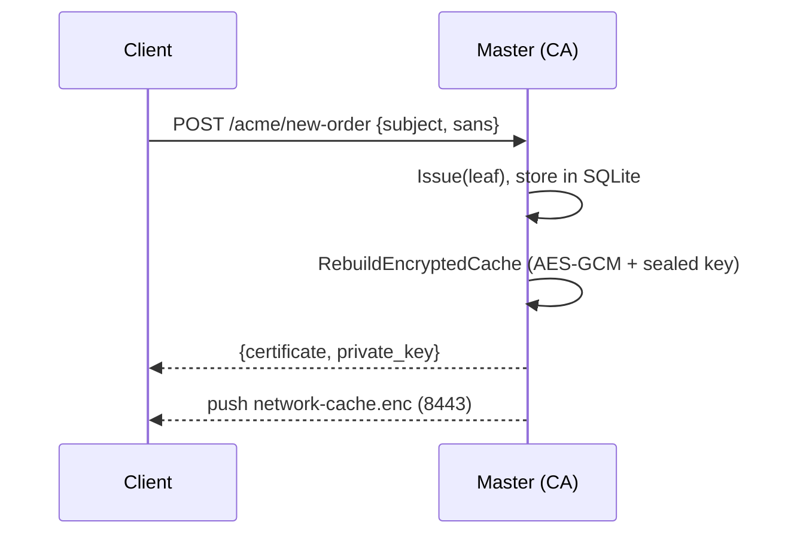
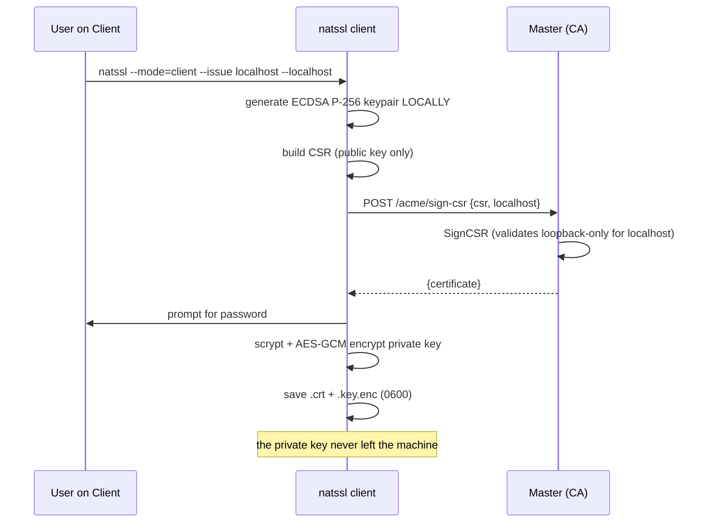

# NATSSL — Deployment Guide

## 1. Topology

| Role | Count (OSS) | Ports | Privileges |
|---|---|---|---|
| Master | **1** (Raft disabled) | 443, 8443 | root (bind <1024, CAP_NET_RAW) |
| Client | N | 8443 (receive push) | root (CA installation) |

---

## 2. Installing from a Release

```bash
ARCH=$(uname -m); case "$ARCH" in
  x86_64) A=amd64;; aarch64|arm64) A=arm64;; esac

tar -xzf natssl-1.0.0-oss-linux-$A.tar.gz
sudo install -m0755 natssl-1.0.0-oss-linux-$A /usr/local/bin/natssl
sudo mkdir -p /etc/natssl /var/lib/natssl
```

Firefox dependencies:

```bash
# Debian/Ubuntu
sudo apt-get install -y libnss3-tools ca-certificates
# RHEL/Rocky/CentOS
sudo dnf install -y nss-tools
```

---

## 3. systemd

`/etc/systemd/system/natssl-master.service`:

```ini
[Unit]
Description=NATSSL Master (Private CA)
After=network-online.target
Wants=network-online.target

[Service]
ExecStart=/usr/local/bin/natssl --mode=master --config=/etc/natssl/config.yaml
Restart=on-failure
AmbientCapabilities=CAP_NET_BIND_SERVICE CAP_NET_RAW
NoNewPrivileges=true

[Install]
WantedBy=multi-user.target
```

`/etc/systemd/system/natssl-client.service`:

```ini
[Unit]
Description=NATSSL Client (Cert Store)
After=network-online.target
Wants=network-online.target

[Service]
ExecStart=/usr/local/bin/natssl --mode=client --config=/etc/natssl/config.yaml
Restart=on-failure
AmbientCapabilities=CAP_NET_BIND_SERVICE CAP_NET_RAW

[Install]
WantedBy=multi-user.target
```

```bash
sudo systemctl daemon-reload
sudo systemctl enable --now natssl-master   # or natssl-client
```

---

## 4. Certificate Lifecycle

### 4.1 Master generates the key (`/acme/new-order`)



### 4.2 Client issues for itself via CSR (`/acme/sign-csr`)



---

## 5. Disaster Scenario (DR)


### Verifying fingerprint identity

```bash
openssl x509 -in /var/lib/natssl/root-ca.crt -noout -fingerprint -sha256
# the value matches before and after promotion
```

---

## 6. Hardening (Production)

| Risk | Action |
|---|---|
| `InsecureSkipVerify` in transport | Replace with `RootCAs` and Root CA pinning |
| `/cache/push` without mTLS | Require a client certificate signed by the Root CA |
| `/acme/sign-csr` without auth | Add mTLS / one-time token per client |
| localhost private key | scrypt(N=2¹⁵)+AES-GCM is **already enabled**; keep the password off the node |
| seed phrase | store offline (paper/HSM), not in a password manager on the node |
| file permissions | `root-ca.key`, `*.key.enc`, `network-cache.enc` → `0600` (already set) |

---

## 7. Diagnostics

```bash
# Master reachability
nc -vz 192.168.10.5 443
nc -vz 192.168.10.5 8443

# Logs
journalctl -u natssl-master -f
journalctl -u natssl-client -f

# Root CA in the OS
trust list | grep -A2 NATSSL                              # RHEL family
ls -l /usr/local/share/ca-certificates/natssl-root.crt    # Debian family

# Root CA in a Firefox profile
certutil -L -d sql:$HOME/.mozilla/firefox/<profile> | grep NATSSL

# Inspect a client-issued certificate
openssl x509 -in /var/lib/natssl/issued/localhost.crt -noout -text | \
  grep -A2 "Subject Alternative Name"
```

---

## 8. Common Error: "issue failed: master is OFFLINE"

This is **expected** behavior (ReadOnly). The client cannot issue a new
certificate while the master is unreachable. Options:

1. Bring the master back up.
2. If the master is physically lost — run `--promote-to-master`.
3. Already-issued certificates keep working until they expire.

---

## 9. FAQ

**Why doesn't the client sign on its own?**
Trust is built on a single Root CA. Distributing its key to every machine
would compromise the entire network. The CSR-flow keeps signing centralized
while the leaf private key stays on the client.

**What if the seed phrase is lost?**
Recovery is impossible — there is nothing to decrypt the cache with. This is
by design.

**Why can't the Root CA be regenerated with the same fingerprint without a backup?**
The SHA-256 fingerprint is the hash of the DER encoding (including the
non-deterministic ECDSA signature). The only correct approach is a
byte-for-byte restore from the encrypted recovery cache.
